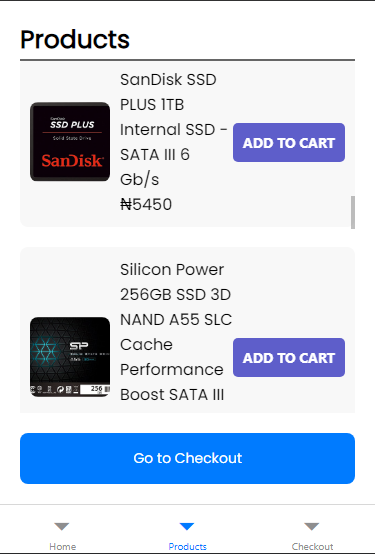
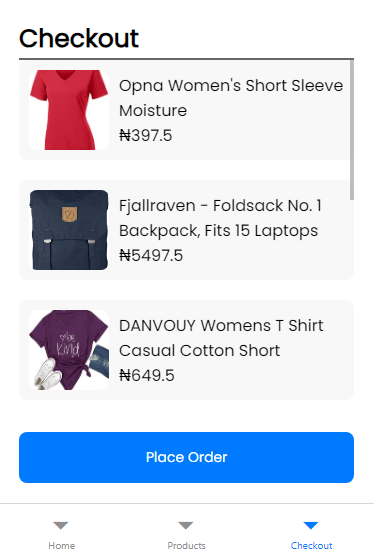
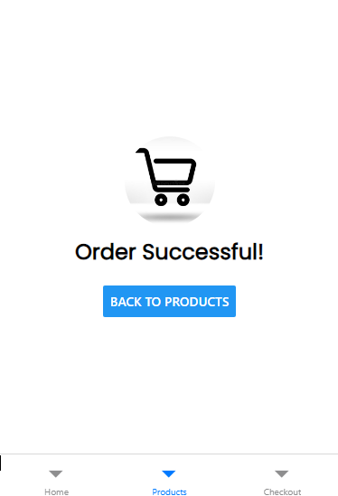

# Simple Shopping App

Welcome to the Simple Shopping App project! This mobile application demonstrates a basic shopping experience using React Native. It was really fun to create.

## Features

- **Products Screen:** Displays a list of products available in the shop.
- **Checkout Screen:** Allows users to add/remove products to/from the checkout list.
- **Navigation:** I put in a bottom navigation bar for easy switching between screens.
- **Order Success:** Upon placing an order, users are navigated to a success screen.

## Technologies Used

- **React Native:** Frontend framework for building native mobile applications.
- **JavaScript/ES6+:** Language used for development.

## Screenshots





## Setup Instructions

To run this project locally:

1. Clone the repository:
   ```bash
   git clone https://github.com/your-username/simple-shopping-app.git
   ```

2. Navigate into the project directory:
   ```bash
   cd simple-shopping-app
   ```

3. Install dependencies:
   ```bash
   npm install
   ```

4. Start the Metro bundler:
   ```bash
   npx react-native start
   ```

5. Run the application on a simulator or device:
   ```bash
   npx react-native run-android  # For Android
   npx react-native run-ios      # For iOS
   ```

## Usage

- Navigate through the app using the bottom navigation bar.
- Add products to the cart on the Products screen.
- Review and remove items on the Checkout screen.
- Place an order and view the success screen.
